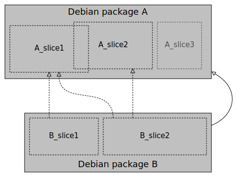
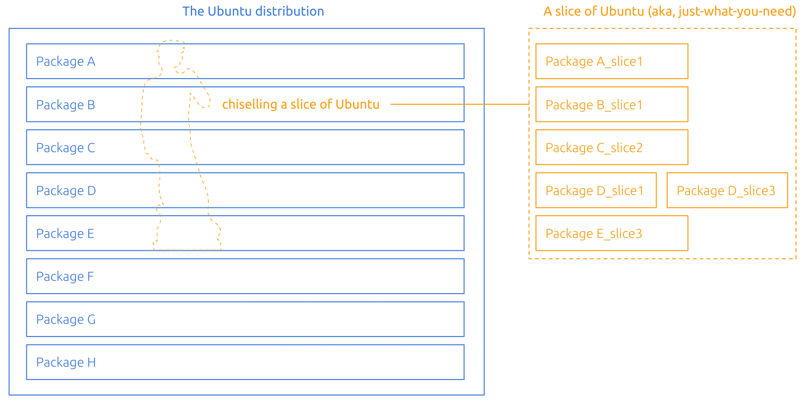

[](https://snapcraft.io/chisel)
[](https://github.com/canonical/chisel/actions/workflows/snap.yml)
[](https://github.com/canonical/chisel/actions/workflows/build.yml)
[](https://github.com/canonical/chisel/actions/workflows/tests.yaml)

# Chisel

**Chisel** is a software tool for carving and cutting Debian packages!

It is built on the idea of **package slices** - minimal, complimentary and
loosely coupled sets of files, based on the package’s metadata and content.
Slices are basically subsets of the Debian packages, with their own content and
set of dependencies to other internal and external slices.

<center>



---


</center>

This image depicts a simple case, where both packages A and B are deconstructed
into multiple slices. At a package level, B depends on A, but in reality, there
might be files in A that B doesn’t actually need (eg. A_slice3 isn’t needed for
B to function properly). With this slice definition in place, Chisel is able to
extract a highly-customized and specialized Slice of the Ubuntu distribution,
which one could see as a block of stone from which we can carve and extract
small and relevant parts we need to run our applications. It is ideal to
support the creation of smaller but equally functional container images.

> “The sculpture is already complete within the marble block, before I start my
> work. It is already there, I just have to chisel away the superfluous
> material.”
>
> \- Michelangelo

In the end, it’s like having a slice of Ubuntu - get *just what you need*. You
*can have your cake and eat it too*!

## Using Chisel

To install the latest version of Chisel, run the following command:

```bash
go install github.com/canonical/chisel/cmd/chisel@latest
```

Chisel is invoked using `chisel <command>`. To get more information:

 - To see a help summary, type `chisel -h`.
 - To see a short description of all commands, type `chisel help --all`.
 - To see details for one command, type `chisel help <command>` or
`chisel <command> -h`.

### Example command

Chisel relies on a [database of slices](https://github.com/canonical/chisel-releases) that are indexed per Ubuntu release.

```bash
chisel cut --release ubuntu-22.04 --root myrootfs/ libgcc-s1_libs libssl3_libs
```

In this example, Chisel would look into the Ubuntu Jammy archives, fetch the
provided packages and install only the desired slices into the *myrootfs*
folder, according to the slice definitions available in the
["ubuntu-22.04" chisel-releases branch](<https://github.com/canonical/chisel-releases/tree/ubuntu-22.04>).

## Reference

### Chisel releases

As mentioned above, Chisel relies on **package slices**. These slices need to
be defined prior to the execution of the `chisel` command.

By default, Chisel will look into its central [chisel-releases](https://github.com/canonical/chisel-releases)
database, where package slices are defined and indexed by Ubuntu release. A
release is identified by the branch name. For example:

```bash
chisel cut --release ubuntu-22.10 ...
```

will tell Chisel to look for a `chisel.yaml` file in the "ubuntu-22.10" branch
of the [chisel-releases](https://github.com/canonical/chisel-releases)
repository. This file will in turn instruct Chisel to fetch the requested
package slices, as defined in the same branch, from the corresponding Kinetic
release in the Ubuntu archives.

Alternatively, one can also point Chisel to a custom and local Chisel release
by specifying a path instead of a branch name. For example:

```bash
chisel cut --release release/ ...
```

#### Chisel release configuration

Each Chisel release must have one "chisel.yaml" file.

*chisel.yaml*:

```yaml
format: <chiselReleaseFormat>

archives:
    ubuntu:
        # Ubuntu archive for Chisel to look into
        version: <ubuntuRelease>

        # categories/components of the Ubuntu archive to look into
        components: [<componentName>, ...]

        # pockets/suites of the Ubuntu archive to look into
        suites: [<pocket>, ...]
```

Example:

```yaml
format: chisel-v2

archives:
    ubuntu:
        version: 22.04
        components: [main, universe]
        suites: [jammy, jammy-security, jammy-updates]
```

#### Slice definitions

There can be only **one slice definitions file** for each Ubuntu package, per
Chisel release. All of the slice definitions files must be placed under a
"slices" folder, and follow the same structure. For example:

*slices/B.yaml*:

```yaml
# (req) Name of the package.
# The slice definition file should be named accordingly (eg. "openssl.yaml")

package: B

# (req) List of slices
slices:

    # (req) Name of the slice
    slice2:

        # (opt) Optional list of slices that this slice depends on
        essential:
          - A_slice1

        # (req) The list of files, from the package, that this slice will install
        contents:
            /path/to/content:
            /path/to/another/multiple*/content/**:
            /path/to/moved/content: {copy: /bin/original}
            /path/to/link: {symlink: /bin/mybin}
            /path/to/new/dir: {make: true}
            /path/to/file/with/text: {text: "Some text"}
            /path/to/mutable/file/with/default/text: {text: FIXME, mutable: true}
            /path/to/temporary/content: {until: mutate}

        # (opt) Mutation scripts, to allow for the reproduction of maintainer scripts,
        # based on Starlark (https://github.com/canonical/starlark)
        mutate: |
            foo = content.read("/path/to/temporary/content")
            content.write("/path/to/mutable/file/with/default/text", foo)
```

Example:

```yaml
package: mypkg

slices:
    bins:
        essential:
            - mypkg_config

        contents:
            /bin/mybin:
            /bin/moved:  {copy: /bin/original}
            /bin/linked: {symlink: /bin/mybin}

    config:
        contents:
            /etc/mypkg.conf: {text: "The configuration."}
            /etc/mypkg.d/:   {make: true}
```

To find more examples of real slice definitions files (and contribute your own),
please go to <https://github.com/canonical/chisel-releases>.

##### Path kinds

As depicted in the example above, the paths listed under a slice's contents can
have additional information for identifying the kind of content to expect:

 - **make**: a `true` or `false` boolean value to specify whether the path must
 be created or not. Example: `/etc/mypkg.d/: {make: true}` instructs Chisel to
 create the directory "/etc/mypkg.d/" (with parent directories). NOTE: the
 provided path must end with "/" for `make` to be valid.
 - **mode**: a 32-bit unsigned integer representing the path mode. Example:
 `/etc/dir/sub/: {make: true, mode: 01777}` instructs Chisel to create the
 directory "/etc/dir/sub/" with mode "01777".
 - **copy**: a string referring to the original path of the content being
 copied. Example: `/bin/moved:  {copy: /bin/original}` instructs Chisel to copy
 the package's "/bin/original" file onto "/bin/moved".
 - **text**: a sequence of characters to be written to the provided file path.
 Example: `/tmp/file1: {text: data1}` will instruct Chisel to write "data1"
 into the file "/tmp/file1".
 - **symlink**: a string referring to the original path (source) of the content
 being linked. Example: `/bin/linked: {symlink: /bin/mybin}` will instruct
 Chisel to create the symlink "/bin/linked", which points to an existing file
 "/bin/mybin".
 - **mutable**: a `true` or `false` boolean value to specify whether the content
 is mutable, i.e. it can be changed after being extracted from the deb. Example:
 `/tmp/file1: {text: data1, mutable: true}` instructs Chisel to populate
 "/tmp/file1" with "data1", while also letting Chisel know that this file's
 content can be mutated via a mutation script.
 - **until**: accepts a `mutate` value to say that the specified content
 shall be removed by Chisel after the mutation scripts are executed. Example:
 `/tmp/file1: {text: data1, until: mutate}` instructs Chisel to populate the
 file "/tmp/file1" with "data1" at installation time, but to then remove it
 right after the slice's mutation scripts are executed. NOTE: while this
 option can be combined with globs (eg. `/tmp/file*: {until: mutate}`), it
 cannot be used to remove non-empty directories.
 - **arch**: accepts a list of known architectures for identifying contents
 which are only available for certain architectures. Example:
 `/usr/bin/hello: {arch: amd64}` will instruct Chisel to extract and install
 the "/usr/bin/hello" file only when chiselling an amd64 filesystem.

## TODO

- [ ] Preserve ownerships when possible
- [ ] GPG signature checking for archives
- [ ] Use a fake server for the archive tests
- [ ] Functional tests


## FAQ

#### May I use arbitrary package names?

No, package names must reflect the package names in the archive,
so that there's a single namespace to remember and respect.

#### I've tried to use a different Ubuntu version and it failed?

The mapping is manual for now. Let us know and we'll fix it.

#### Can I use multiple repositories in a Chisel release?

Not at the moment, but maybe eventually.

#### Can I use non-Ubuntu repositories?

Not at the moment, but eventually.

#### Can multiple slices refer to the same path?

Yes, but see below.

#### Can multiple slices _output_ the same path?

Yes, as long as either both slices are part of the same package,
or the path is not extracted from a package at all (not copied)
and the explicit inline definitions match exactly.

#### Is file ownership preserved?

Not right now, but it will be supported.
