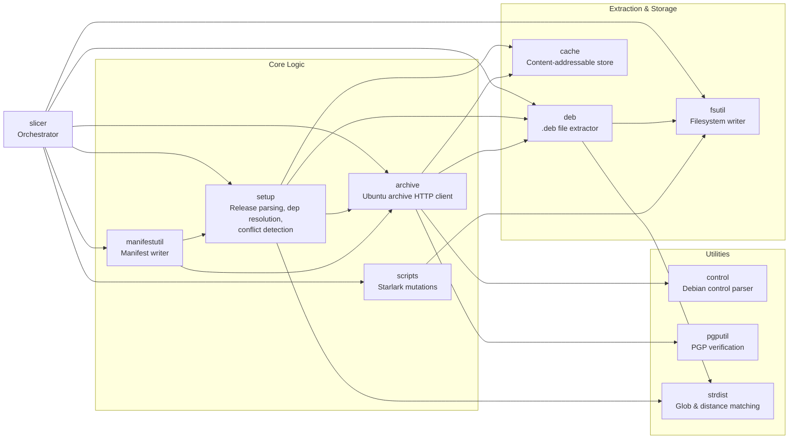

# Preface

This is the index file for the `internal/` directory's knowledge base. It provides context about the core internal packages of Chisel, encompassing slice orchestration, package setup, extraction, archive fetching, caching, filesystem operations, manifest generation, and supporting utilities.

# Overview

The `internal/` directory houses the core business logic, components, and utilities of Chisel. It coordinates slice selection, dependency resolution, package fetching, file extraction, filesystem mutations, and manifest output. These packages are not part of Chisel's public API and must not be imported by external consumers.

# Directory

- `slicer/` - Main orchestrator for a Chisel run. Receives a slice selection, drives all other internal packages (setup, archive, cache, deb, fsutil, scripts, manifestutil) to completion, and writes the final filesystem and manifest.
- `setup/` - Parses chisel-releases YAML definitions into the `Release` model and resolves slice dependencies, path conflicts, and package contention.
- `deb/` - Extracts files from `.deb` archives (AR format with tar/gzip/xz/zstd inner layers).
- `archive/` - Manages remote Ubuntu package archive sources over HTTP/HTTPS.
- `cache/` - Content-addressable on-disk store keyed by SHA256 digest, with time-based eviction.
- `fsutil/` - Core filesystem operations for writing files, directories, and symlinks into the target root filesystem.
- `manifestutil/` - Generates the Chisel manifest.
- `scripts/` - Executes Starlark mutation scripts defined in slice definitions.
- `control/` - Parser for Debian control files (the metadata sections embedded in `.deb` archives).
- `strdist/` - String distance and glob matching utilities. Implements a configurable edit-distance algorithm (`Distance`) with pluggable cost functions, and a `GlobPath` function that uses that algorithm to match file paths against patterns supporting `?`, `*`, and `**` wildcards.
- `pgputil/` - Decodes and validates PGP signatures on package archive metadata. Wraps `golang.org/x/crypto/openpgp`.
- `testutil/` - Shared test helpers used across unit tests: mock archive builders, composable content checkers, file presence and permission validators, tree dumpers, and permutation utilities.
- `apacheutil/` - Shared slice-naming utilities (`SliceKey`, name-format regexps, `ParseSliceKey`). The "apache" prefix signals that this package carries an Apache-2.0 license, which is required because it is a transitive dependency of the `public/` packages.
- `apachetestutil/` - Test helpers for reading manifest contents (`DumpManifestContents`), carrying the same Apache-2.0 license requirement as `apacheutil/` because it is depended on by tests in the `public/` packages.

# Architecture

Chisel's internal packages form a directed dependency chain driven by `slicer/`:

